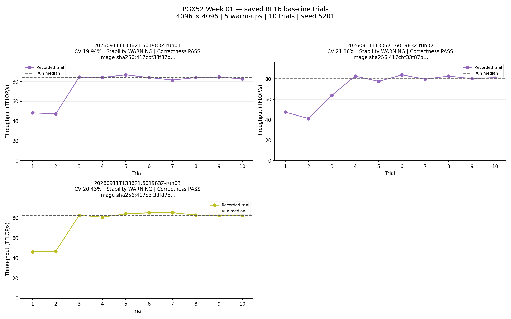

# Week 01 results

Session: `20260911T133621.601983Z`

| Run | Correctness | Relative L2 error | Median TFLOP/s | Variability | Stability |
|---|---|---:|---:|---:|---|
| 1 | PASS | 0.288% | 84.05 | 19.94% | WARNING |
| 2 | PASS | 0.288% | 80.11 | 21.86% | WARNING |
| 3 | PASS | 0.288% | 82.42 | 20.43% | WARNING |

Image: `nvcr.io/nvidia/pytorch@sha256:417cbf33f87b5378849df37983552cd1f8bc8b62fe1ceabe004de816a55dff21`

Workload: 4096 × 4096 BF16; 5 warm-ups; 10 timed trials per run; seed 5201.

A stability warning means throughput CV > 10%; the saved measurement remains valid.
These back-to-back measurements characterize this synthetic workload, not LLM performance.
The numerical reference covers a smaller 256 × 256 calculation; timed trials check one output element.

